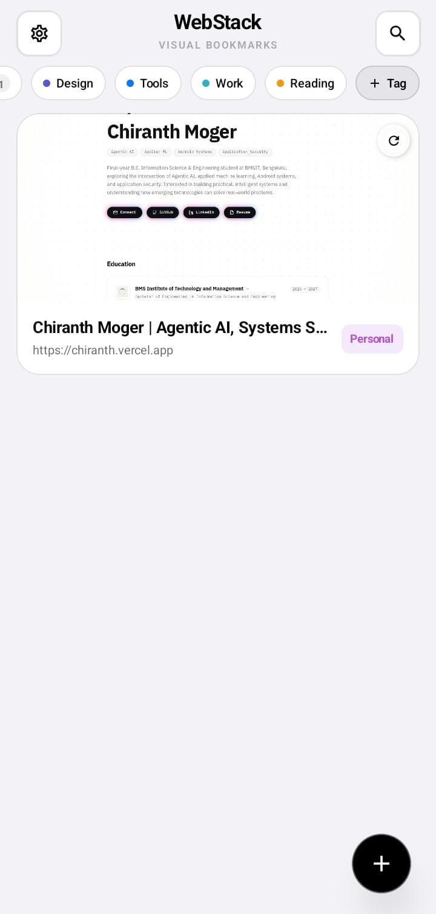
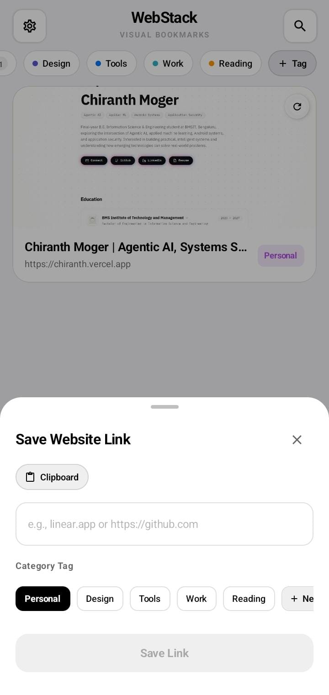
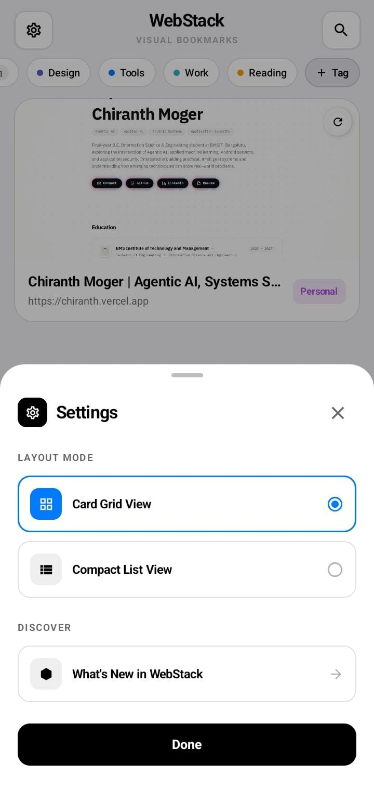

# WebStack

A high-performance visual bookmark manager and website stack for Android built with Jetpack Compose, Material Design 3, Room Database, and Kotlin Coroutines.

[](https://f-droid.org/packages/com.chiranth7.webstack/)
[](LICENSE)
[](https://android.com)
[](https://kotlinlang.org)
[](https://developer.android.com/jetpack/compose)

<br>

<a href="https://f-droid.org/packages/com.chiranth7.webstack/">
  
</a>

<br>

---

## Overview

Modern web navigation often leads to tab clutter and lost links buried deep within browser submenus. **WebStack** solves this by providing Android users with a centralized, visual bookmarking hub. Every saved link is captured with responsive snapshot rendering, automated favicon extraction, custom category tagging, and local offline caching.

---

## Key Features

- **Visual Website Cards**: Captures and renders high-resolution page previews and favicons for fast visual scanning.
- **Dual Display Modes**: Seamlessly toggle between full visual screenshot cards and dense compact row listings.
- **Hardware-Accelerated Search**: Zero-lag filtering across website titles, domains, and custom tags with 60/120 FPS transitions.
- **Dynamic Category Management**: Create, rename, delete, and filter custom category tags with interactive bottom sheets.
- **Offline Snapshot Caching**: Previews and metadata are persisted locally on-device for instant loading without mobile data consumption.
- **Native Android Share Sheet**: Receive and save links directly from Google Chrome, Firefox, or any application in one tap.
- **Smart Clipboard Detection**: Automatically suggests saving valid URLs detected on the system clipboard.
- **Zero Trackers & Privacy First**: Fully open source with no telemetry, advertising SDKs, or third-party tracking libraries.

---

## Screenshots

| Visual Bookmark Stack | Save Link Sheet | Settings & Layout Modes |
| :---: | :---: | :---: |
|  |  |  |

---

## Architecture & Tech Stack

```
webstack/
├── app/
│   ├── src/main/java/com/example/
│   │   ├── data/
│   │   │   ├── Website.kt           # Room entity definition
│   │   │   ├── WebsiteDao.kt        # Data access object with Flow streams
│   │   │   ├── WebsiteDatabase.kt   # Room database singleton
│   │   │   └── WebsiteRepository.kt # Repository abstraction & network fetching
│   │   ├── ui/
│   │   │   ├── theme/               # Color tokens, typography, and theme styling
│   │   │   └── viewmodel/           # WebsiteViewModel (StateFlow, category persistence)
│   │   └── MainActivity.kt          # Compose UI architecture, Navigation Header, Cards & Sheets
│   └── src/test/                    # Unit tests, Robolectric, and Roborazzi snapshot tests
├── fastlane/metadata/android/       # F-Droid Fastlane metadata
├── metadata/                        # F-Droid build recipe specification
└── .github/workflows/               # CI/CD automated release pipeline
```

### Core Technologies
| Component | Technology | Purpose |
| :--- | :--- | :--- |
| **Language** | Kotlin 2.2.10 | Core application logic and asynchronous coroutines |
| **UI Framework** | Jetpack Compose | Declarative UI rendering with Material 3 design tokens |
| **Persistence** | Room SQLite Database | Local structured storage with reactive Flow observables |
| **Image Pipeline** | Coil Compose | Asynchronous image loading with memory and disk caches |
| **HTTP Client** | OkHttp 4.12.0 | Website metadata fetching and favicon resolution |
| **Testing** | JUnit 4, Robolectric | Instrumented unit tests and screenshot regression testing |

---

## Getting Started

### Prerequisites
- Android Studio Ladybug (2024.2.1) or higher
- JDK 17 or JDK 21
- Android SDK Platform 35
- Physical device or emulator running Android 8.0 (API 26) or higher

### Build Instructions

1. Clone the repository:
   ```bash
   git clone https://github.com/Chiranth-Janardhan-moger/webstack.git
   cd webstack
   ```

2. Build debug APKs:
   ```bash
   ./gradlew assembleDebug
   ```

3. Build optimized release APKs:
   ```bash
   ./gradlew assembleRelease
   ```

Generated APK binaries will be located in:
`app/build/outputs/apk/release/`

### Running Unit Tests

Run local unit tests and Robolectric verification:
```bash
./gradlew testDebugUnitTest
```

---

## Download & Installation

WebStack is available on F-Droid and GitHub Releases for Android.

<div align="center">

<a href="https://f-droid.org/packages/com.chiranth7.webstack/">
  
</a>

<p>
  <a href="https://f-droid.org/packages/com.chiranth7.webstack/"><strong>Get it on F-Droid</strong></a> &bull; 
  <a href="https://github.com/Chiranth-Janardhan-moger/webstack/releases/latest"><strong>Download GitHub Release APK</strong></a>
</p>

</div>

### Installation Channels

- **F-Droid Store (Recommended)**: Install via the official F-Droid client app or download directly from the [WebStack F-Droid Package Page](https://f-droid.org/packages/com.chiranth7.webstack/). Automatic updates and reproducible builds are guaranteed through F-Droid.
- **GitHub Releases**: Download standalone signed release APK (`app-release.apk`) directly from [GitHub Releases](https://github.com/Chiranth-Janardhan-moger/webstack/releases/latest).

---

## F-Droid Package Details

WebStack is officially published in the upstream F-Droid repository:
- Package Page: [https://f-droid.org/packages/com.chiranth7.webstack/](https://f-droid.org/packages/com.chiranth7.webstack/)
- Merge Request: [fdroid/fdroiddata!46490](https://gitlab.com/fdroid/fdroiddata/-/merge_requests/46490) (Merged into master)
- Free and Open Source (MIT License)
- Reproducible Gradle builds verified against upstream signing keys (`fc5583b...`)
- Package ID: `com.chiranth7.webstack`
- Recipe file: [`metadata/com.chiranth7.webstack.yml`](metadata/com.chiranth7.webstack.yml)


---

## License

This project is licensed under the MIT License. See the [LICENSE](LICENSE) file for details.
